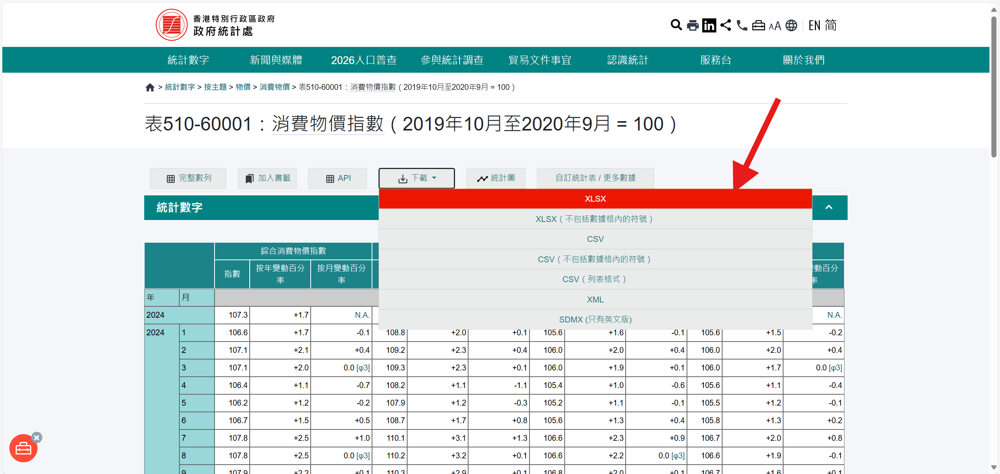
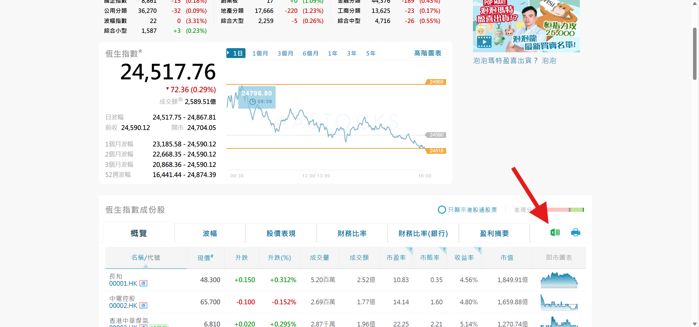
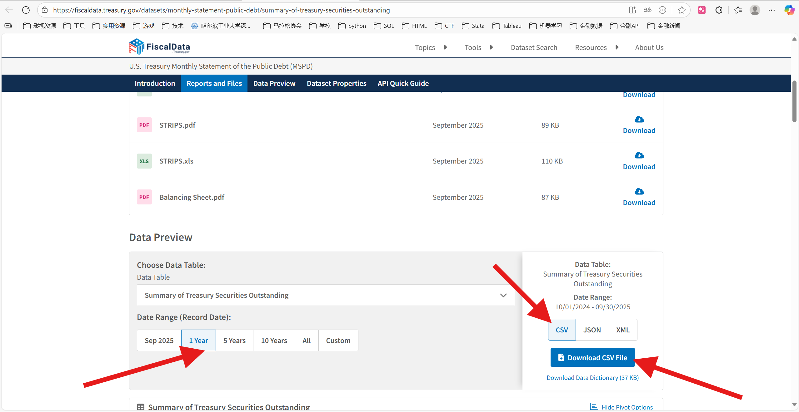
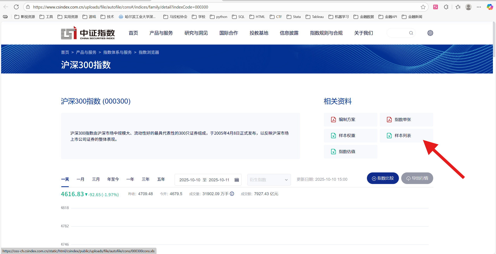
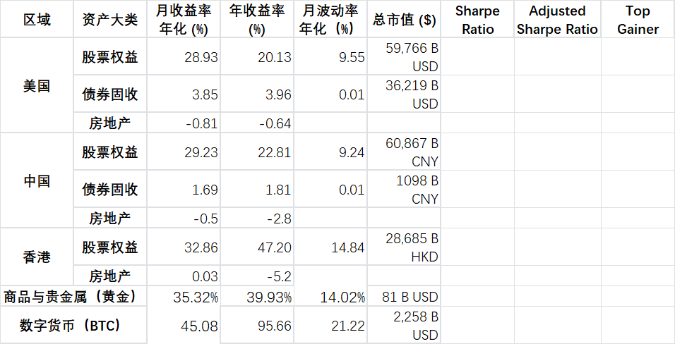

### 一、项目概述

- `asset_mgnt_report` 用于生成资产管理周报相关数据，覆盖 CPI、GDP、利率、利差、汇率、股票权益、债券、商品与贵金属、数字货币，以及二级市场补充报表。
- 项目已经工程化为三层：
  - 根目录工程配置：保留 Docker、依赖、说明文档和版本控制配置
  - `scripts/`：正式脚本入口、资产管线脚本、校验脚本
  - `src/asset_mgnt_report/`：统一配置、共享算法、运行调度、Web UI
- 运行输出默认写入 `output/`，便于复核、对比和二次加工。

### 二、前置准备

#### 1. Python 依赖

- 安装依赖：

```powershell
pip install -r requirements.txt
```

#### 2. FRED_API_KEY

- 部分脚本需要从 FRED 获取数据，请先配置环境变量 `FRED_API_KEY`
- 申请地址： [FRED_API_KEYS](https://fredaccount.stlouisfed.org/apikeys)

PowerShell 临时设置示例：

```powershell
$env:FRED_API_KEY="your_fred_api_key"
```

#### 3. 手动准备的数据文件

主要通过 AKShare、yfinance 和 FRED 自动获取数据，但仍有少量数据需要提前下载并放入 `data/seeds/`。

> 已设置文件名正则匹配，更新文件后通常不需要改代码

- 香港 CPI：[政府統計處 : 表510-60001：消費物價指數](https://www.censtatd.gov.hk/tc/web_table.html?full_series=1&id=510-60001#)
  - 需要选择“完整数列”，下载长周期完整数据
  - 删去按年计算的 CPI，仅保留按月结果


- 恒生指数成分股：[指數及成份股 - 指數成份股 - 恆生指數](http://www.aastocks.com/tc/stocks/market/index/hk-index-con.aspx?index=HSI)


- 美国财政部流通国债总票面价值：[U.S. Treasury Monthly Statement of the Public Debt (MSPD)](https://fiscaldata.treasury.gov/datasets/monthly-statement-public-debt/summary-of-treasury-securities-outstanding)


- 沪深300成分股名录：[沪深300指数 (000300)](https://www.csindex.com.cn/uploads/file/autofile/cons#/indices/family/detail?indexCode=000300)


#### 4. “整体”表格准备

- 需要先把各资产大类的 `月收益率年化 (%)`、`年收益率 (%)`、`月波动率年化（%）`、`总市值 ($)` 按 `整体.xlsx` 模板整理到 `data/seeds/整体.xlsx`
- 还需要把 `output/fx_metrics.xlsx` 中的汇率表复制到 `整体.xlsx` 的 `Sheet2`
- 然后再执行 `整体.py`

整体表格整理示例：


### 三、使用方法

#### 1. 本地 Python 运行

- 一键运行主报表：

```powershell
python scripts/main.py
```

- 运行 Gainer 汇总：

```powershell
python scripts/gainer.py
```

- 运行整体表：

```powershell
python scripts/overall.py
```

- 运行二级市场补充报表：

```powershell
python -m scripts.pipelines.secondary_market_report
```

#### 2. 参数配置

参数配置有三层优先级，从高到低依次为：

1. 环境变量
2. 入口脚本顶部的 `CONFIG`
3. `src/asset_mgnt_report/config/defaults.py` 中的默认配置

最常改的是 `scripts/` 下四个入口脚本顶部的 `CONFIG`：

- `scripts/main.py`
  - `debug`
  - `modules`
- `scripts/gainer.py`
  - `current_date`
  - `previous_date`
  - `current_gold_price`
  - `previous_gold_price`
- `scripts/overall.py`
  - `input_path`
  - `output_path`
  - `log_path`
- `scripts/web_ui.py`
  - Web UI 本身不单独维护参数，直接复用统一配置

环境变量适合 Docker 和自动化场景，常用项包括：

- `AMR_DEBUG`
- `AMR_USE_PROXY`
- `AMR_HTTP_PROXY`
- `AMR_HTTPS_PROXY`
- `FRED_API_KEY`
- `AMR_GAINER_CURRENT_DATE`
- `AMR_GAINER_PREVIOUS_DATE`
- `AMR_GOLD_CURRENT_PRICE`
- `AMR_GOLD_PREVIOUS_PRICE`

#### 3. Web UI 运行

- 启动方式：

```powershell
streamlit run scripts/web_ui.py
```

- 默认访问地址：
  - `http://localhost:8501`

- Web UI 可用于：
  - 通过顶部标签在主页、主报表、Gainer、整体表、校验五个工作区之间切换
  - 默认启用代理模式，也可在侧边栏关闭
  - 在主页概览中同时查看四个工作入口
  - 选择主报表模块
  - 在页面内通过日历选择 Gainer 的 `本周末日期（周六）` 和 `两周前日期（周六）`
  - 参考 LBMA Gold Price 页面中的 `USD PM` 填写黄金价格
  - 在页面内指定整体表输入、输出、日志路径
  - 在当前标签页内保留运行结果，不再因工作区切换出现空白页
  - 触发 main / codex 输出校验

#### 4. Docker 运行

- 构建镜像：

```powershell
docker build -t asset-mgnt-report .
```

- 启动 Web UI：

```powershell
docker compose up amr-ui
```

- 在容器中运行主报表：

```powershell
docker compose run --rm amr-cli python -m scripts.main
```

- 在容器中运行校验：

```powershell
docker compose run --rm amr-cli python -m scripts.validation.validate_outputs
```

更完整的 Docker 说明见：
- `docs/docker部署与使用指南.md`
- `docs/版本迭代日志.md`

#### 5. 输出位置

- 主输出目录：`output/`
- 原始调试数据：`output/raw_data/`
- main / codex 对比报告：`docs/重构前后对比报告.md`

### 四、项目结构

- `scripts/main.py`：主报表入口
- `scripts/gainer.py`：Gainer 入口
- `scripts/overall.py`：整体表入口
- `scripts/web_ui.py`：Web UI 启动入口
- `scripts/pipelines/`：各资产大类与报表脚本
- `scripts/validation/`：回归与对比校验脚本
- `src/asset_mgnt_report/`
  - `config/`：统一配置与环境变量解析
  - `metrics/`：统一收益率、年化、波动率、Sharpe 算法
  - `io/`：路径和输入输出辅助
  - `services/`：脚本调度、结果校验
  - `ui/`：Streamlit Web UI
- `data/seeds/`：纳入版本控制的种子数据
- `data/local/`：本地临时输入，不纳入版本控制
- `output/`：运行输出
- `archive/legacy_code/`：历史脚本归档
- `archive/legacy_code/stock_us_cn_hk/`：原二级市场独立目录归档与历史产物留档
- `docs/assets/`：Readme 与文档使用的静态图片
- `docs/`：说明文档、版本日志与对比报告

### 五、输出文件说明

| 指标模块 | 来源脚本 | 输出文件名 |
| --- | --- | --- |
| CPI | `scripts/pipelines/cpi_report.py` | `cpi_metrics.xlsx`、`cpi_trends.png` |
| GDP | `scripts/pipelines/gdp_report.py` | `gdp_metrics.xlsx` |
| 利率 | `scripts/pipelines/interest_rate_report.py` | `interest_rate_metrics.xlsx`、`interest_rate_trend_2y.png` |
| 利差 | `scripts/pipelines/carry_trade_report.py` | `currency_spreads.png` |
| 汇率 | `scripts/pipelines/fx_report.py` | `fx_metrics.xlsx` |
| 股票权益 | `scripts/pipelines/stock_index_report.py`、`scripts/pipelines/stock_cap_report.py` | `stock_weekly_report.xlsx` |
| 债券 | `scripts/pipelines/bond_report.py` | `bonds.xlsx` |
| 商品与贵金属 | `scripts/pipelines/precious_metals_report.py` | `commodity_indicators_summary.xlsx` |
| 数字货币 | `scripts/pipelines/crypto_report.py` | `crypto_metrics.xlsx` |
| Gainer | `scripts/gainer.py` | `Gainer.xlsx` |
| 整体 | `scripts/overall.py` | `整体_processed.xlsx` |
| 二级市场 | `scripts/pipelines/secondary_market_report.py` | `mixed_market_report_*.xlsx` |

### 六、数据获取及计算方法

#### 1. 统一指标口径

- 日频可投资资产统一先计算 `pct_change()` 日收益率
- 年化收益率统一通过 `src/asset_mgnt_report/metrics/annualization.py`
- 年化波动率统一通过 `src/asset_mgnt_report/metrics/volatility.py`
- Sharpe / Adjusted Sharpe 统一通过 `src/asset_mgnt_report/metrics/sharpe.py`
- 地区无风险利率统一配置：
  - `US = 0.045`
  - `CN = 0.017`
  - `HK = 0.0062`

#### 1.1 汇率数据源策略

- 汇率模块主源仍为 AkShare 的 `forex_hist_em`
- 若 Eastmoney 抓取失败，会按顺序降级到：
  - `yfinance`
  - AkShare 官方人民币历史接口：`currency_boc_safe`
  - AkShare 官方人民币历史接口：`currency_boc_sina`
  - 本地缓存
- `fx_metrics.xlsx` 会写出 `数据源` 字段，标记本次汇率指标来自主源、备用源、官方降级源或缓存

#### 2. CPI

| 地区 | 数据类型 | 数据源说明 |
| --- | --- | --- |
| 美国 | 月度 CPI（MoM） | `akshare.macro_usa_cpi_monthly()` |
| 美国 | 年度 CPI（YoY） | `akshare.macro_usa_cpi_yoy()` |
| 美国 | 年度 PCE（YoY） | `akshare.macro_usa_core_pce_price()` |
| 中国 | 月度 CPI（MoM） | `akshare.macro_china_cpi_monthly()` |
| 中国 | 年度 CPI（YoY） | `akshare.macro_china_cpi_yearly()` |
| 香港 | 年度&月度 CPI | 本地 Excel：`data/seeds/Table 510-60001_tc.xlsx` |

$$
\text{CAGR} = \left( \prod_{i=1}^{n} \left(1 + \frac{r_i}{100} \right) \right)^{\frac{1}{n}} - 1
$$

#### 3. GDP

| 区域 | 数据 | 数据来源 |
| --- | --- | --- |
| 美国 | YoY(%) | `akshare.macro_usa_gdp_monthly()` |
| 美国 | 当前季度 GDP | `fred.get_series('NGDPSAXDCUSQ')` |
| 美国 | 当前年化 GDP | `FRED API`：`series_id='GDP'` |
| 中国 | YoY(%) | `akshare.macro_china_gdp_yearly()` |
| 中国 | 当前季度 GDP | `akshare.macro_china_gdp()`，计算季度差分 |
| 中国 | 当前年化 GDP | 最近四个季度 GDP 差分求和 |
| 香港 | YoY(%) | `akshare.macro_china_hk_gbp_ratio()` |
| 香港 | 当前季度 GDP | `akshare.macro_china_hk_gbp()` |
| 香港 | 当前年化 GDP | 最近四个季度 GDP 求和 |

#### 4. 利率与利差

- 利率：
  - 美国：Federal Fund Rate
  - 中国：LPR、Chibor
  - 香港：HIBOR
- 利差：
  - `CNH - USD`
  - `HKD - USD`
  - `CNH - HKD`

MoM、YoY 算法均使用共享容忍窗口逻辑。

#### 5. 汇率

| 汇率 | 数据来源 |
| --- | --- |
| USD/CNH | `akshare.forex_hist_em()` |
| USD/HKD | `akshare.forex_hist_em()` |
| CNH/HKD | 由 USD/CNH 与 USD/HKD 跨式计算 |

#### 6. 股票权益

| 市场 | 指数名称 | 数据来源 |
| --- | --- | --- |
| 美国 | S&P 500 | `ak.index_us_stock_sina(symbol=".inx")` |
| 中国 | 沪深300 | `ak.stock_zh_index_daily("sh000300")` |
| 香港 | 恒生指数 | `ak.stock_hk_index_daily_sina("HSI")` |

- 年化收益率统一使用共享函数，不再区分“短期算术、长期几何”的分裂实现
- 年化波动率统一为：

$$
\sigma_{\text{ann}} = \sigma_{\text{daily}} \times \sqrt{252}
$$

- Sharpe Ratio 统一为：

$$
\text{Sharpe Ratio} = \frac{r_{\text{ann}} - r_f}{\sigma_{\text{ann}}}
$$

#### 7. 债券

**中国国债**

| 指标类型 | 数据项 | 数据来源 |
| --- | --- | --- |
| 总市值 | 国债托管面值 | `ak.bond_cash_summary_sse(date=...)` |
| 交易量 | 记账式国债当日成交金额 | `ak.bond_deal_summary_sse(date=...)` |
| 收益率 | 2年、10年期国债收益率 | `ak.bond_zh_us_rate()` |

**美国国债**

| 指标类型 | 数据项 | 数据来源 |
| --- | --- | --- |
| 总市值 | 国债总额 | `fred.get_series('GFDEBTN')` |
| 收益率 | 2年、10年期国债收益率 | `pandas_datareader.data.DataReader()` |

#### 8. 商品与贵金属

| 标的代码 | 品类 | 数据来源 |
| --- | --- | --- |
| GLD | 黄金 ETF | `yfinance.Ticker("GLD").history(period="6y")` |
| CL=F | 原油期货 | `yfinance.Ticker("CL=F").history(period="6y")` |
| HG=F | 铜期货 | `yfinance.Ticker("HG=F").history(period="6y")` |

#### 9. 整体

- 波动率和 Sharpe Ratio 统一使用月度数据
- `Adjusted Sharpe` 统一通过共享函数计算
- 汇率修正逻辑仍保留，但实现已收敛到统一算法层

### 七、Docker 与 Web UI

- Docker 适合：
  - 跨设备迁移
  - 给不会 Python 的协作者直接使用
  - 固定依赖环境，减少“我这里能跑、别人那里不能跑”
- Web UI 适合：
  - 在页面中勾选模块
  - 不直接改代码
  - 运行主报表 / Gainer / 整体 / 校验

建议阅读：
- `docs/docker部署与使用指南.md`
- `docs/版本迭代日志.md`
- `docs/重构前后对比报告.md`
